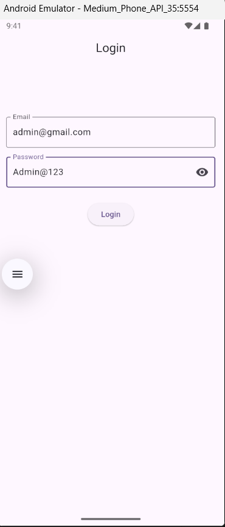
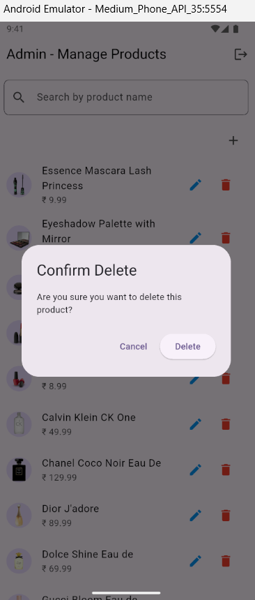

# Market UI Flutter

A simple and responsive Flutter application that demonstrates a complete product management flow including:

-  User authentication
-  Product listing
-  Product details view
-  Product management with CRUD operations

This project was developed as part of an interview task for the **Flutter Developer** position at **Flxiidesx Workspaces Pvt Ltd**.

---

## Features

### Authentication Page
- login functionality
- Input validation and error handling
- Responsive design with loading states

### Product Listing Page
- Displays all available products in a grid view
- Includes product name, price, thumbnail, and brief description
- Category and price range filtering
- Search functionality with live updates
- Mobile and tablet responsiveness

### Product Details Page
- Shows full product specifications
- Price breakdown including discounts
- Displays product tags, availability status, and customer reviews

### Product Management (Admin)
- Add, edit, delete products
- Confirmation dialogs for delete actions
- Admin-only access for management functions

---

## 💻 Screenshots

| Login Page | Product List | Product Details |
|------------|--------------|-----------------|
|  |  |  |

| Add Product | Edit Product |
|-------------|--------------|
|  |  |

> 📂 Screenshots are available in the `/assets` folder.

---

## Contact

Feel free to reach out for any questions or collaboration!

**Diya Betcy**  
diyabetcy123@gmail.com 
Kerala, India

---

